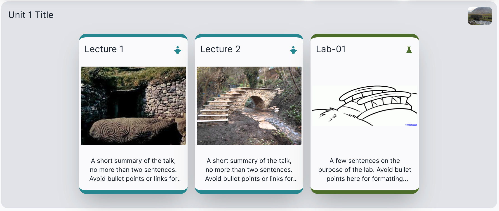

# Talks

Talks are typically embedded within units:

The represent a PDF version of slide decks, but can be any PDF document. Each talk will be rendered initially as a card:

The Title and summary will be drawn from the `.md` file in the talk folder, and the image from a PNG or JPEG file, and the PDF must also be in the folder. You can use any name for these files - but all three files names must be identical. The `.md` file is a simple title + summary:

~~~md
Lecture 1

A short summary of the talk, no more than two sentences. 
~~~

Make some cosmetic changes to some of the talks. Compile and republish the course to see the effects. A summary of how compile/publish is on the last step of this lab.
