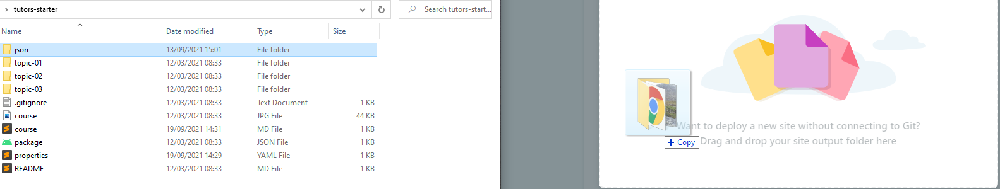

# Publish a Course

To pusblish a course, you ned to do the following:

-  `compile` the course (regenerate it). The `compile` process produces a new version of the  `JSON` folder located within the `tutors-starter` folder. 
-  drag and drop the newly generated folder `JSON` folder to the Netlify drop area for your published site as in the previous step.  

Here is how to do this:

First, open a Command Prompt (or Terminal on Mac). Side by side open the folder where your course is located:

In the Command Prompt, type:

~~~
cd 
~~~

... make sure to leave a space at the end:

Now drag & drop the `tutors-starter` folder from the Finder window onto the command prompt:

This will insert the full path of the folder (see above). Press `Return or Enter` now, and then type:

 ~~~
dir
 ~~~

Your Command prompt window should look as above - you have changed into the `tutors-course` folder, and this is verified by entering the `dir` command.

To compile the course, enter the following and press return:

~~~
npx tutors-json
~~~

You should see the above after a few minutes. This is a list of the course contents. The `JSON` directory will have been updated to the latest version.

To publish the course to the web, you will need to create an account on Netlify:

- <https://www.netlify.com/>

Once you create an account and log in, you should see a page something like this:

Underneath the `Sites` heading is a box. This is where you can upload a new version of the course. In your course template, you already have a 'compiled' version of the course in the `JSON` folder:

Drag and drop this folder directly onto the drop area:

 

The site will now be published (deployed) and you will be redirected  to the site overview page:

You can see under `Production Deploys` that the site has been published, click the link in the box at the top of the page. 

This will bring you to your Tutors course website - now published and available to all via the link.

This is your copy of the sample course - independent of any other version, and it is now available globally via the link.

This link is not very friendly so we should change it. Navigate back to Netlify and select the `Domain settings` button 

then scroll down to the `Custom Domains` section and click the Dropdown `Options` button and select `Edit site name`.

Enter the desired domain name for your Tutors site and click `Save`.

The name must be unique globally - so the above name will not work as-is, so append your initials, the date, or whatever scheme makes sense.

Return to the `Site Overview` page where you will notice the link to your site has changed.

