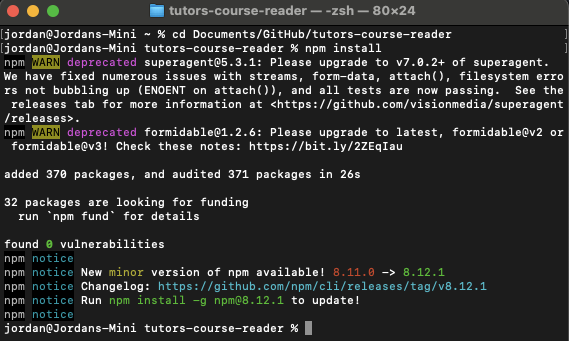
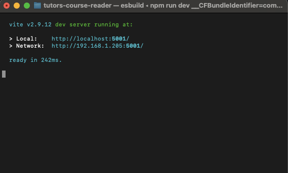

## Download Tutors Reader

We will start by downloading the Tutors Reader source files to our machine.

First off, we're going to want to clone the tutors-course-reader repo from GitHub. So clone this using your favourite Git application, the CLI or download & extract the source ZIP file.

~~~
https://github.com/tutors-sdk/tutors-course-reader
~~~

Once this is cloned, navigate to the folder you have it saved to in terminal and install the dependancies by running

~~~
npm install
~~~

You should get an output similar to above, and the node_modules folder will populate.

Rename the .env.example file to .env to set up the default environment variables.

Then finally, we want to run the reader by typing the below into the terminal window:

~~~
npm run dev
~~~

once this is ran, you will get an output like the below

🎉 You now have the course reader running locally - on to the next step!