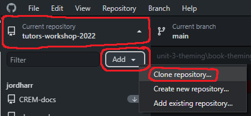
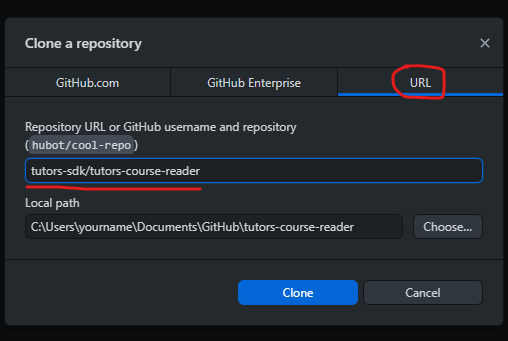
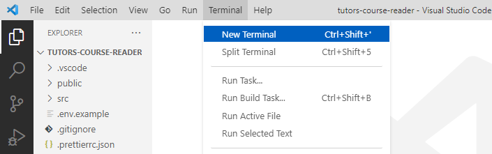

## Download Tutors Reader

We will start by downloading the Tutors Reader source files to our machine. For this, you'll need GitHub Desktop Installed.

- [GitHub Desktop](https://desktop.github.com/)

In GitHub Desktop, at the top left select the current repository dropdown, then press add and Clone repository...

The select the URL tab at the top and type the below into the Respository URL and press Clone.

~~~
tutors-sdk/tutors-course-reader
~~~

Once this is cloned, select the "Open in Visual Studio Code" (or your selected text editor) button

It should open up the course reader files in VS Code. We now need to install the dependancies so we can run it locally. Open a terminal windows by going to Terminal -> new terminal in the menu bar.

Enter the below to the terminal window to install the dependancies:

~~~
npm install
~~~

You should get an output similar to below, and the node_modules folder will populate.

Then finally, we want to run the reader by typing the below into the terminal window:

~~~
npm run dev
~~~

once this is ran, you will get an output like the below

🎉 You now have the course reader running locally - on to the next step!