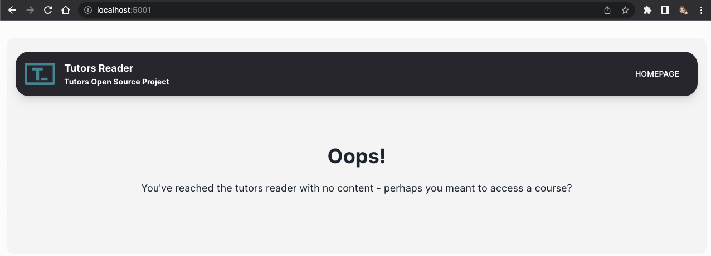
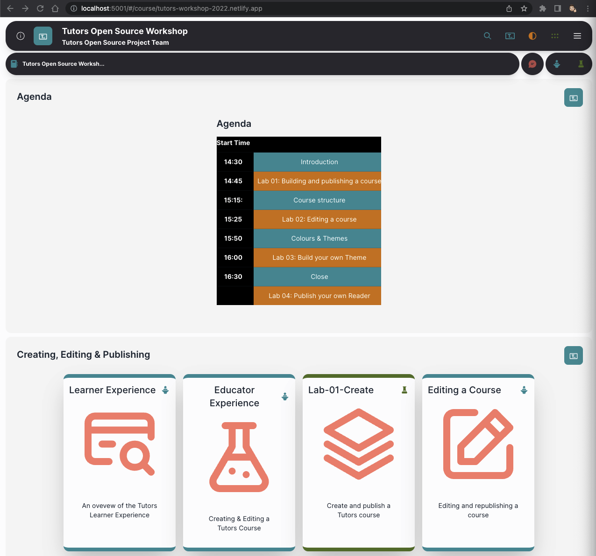

# Reading a course

The course reader is built as an SPA (single page application) using svelte-spa-router. This uses hash based routing to load a course.

For the below example, we will use this workshop's deployed netlify URL to read from.

First up, let's open the course reader we are running by navigating to the course URL displayed in your terminal window.

Here we can see that there is no course loaded for the reader, so we will add this workshop's URL into the route, such as the below example.

~~~
http://localhost:5001/#/course/tutors-workshop-2022.netlify.app
~~~

🥳 Now we're getting somewhere! You should now see the workshop is being read by the course reader and displaying the course!