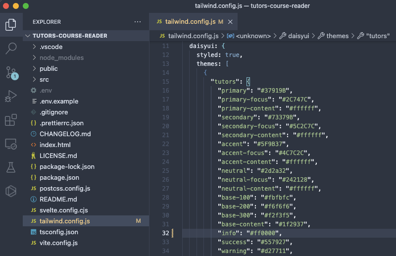
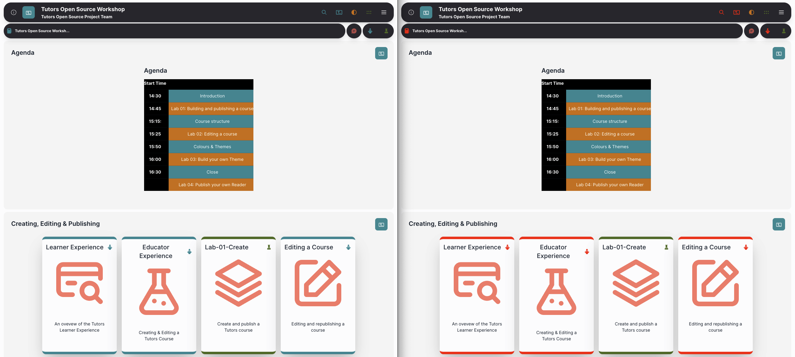

# Modifying a theme

Now let's look at modifying one of the themes.

The powerful thing about using vite as our dev server is that it has a hot reload function. So when we make changes to the files it will automatically update the page in our browser - allowing us to visually see the difference as we code!

Open up the tailwind.config.js file in the root of the project directory and we can see the themes being declared under module.exports -> daisyui -> themes

Make sure you have the tutors theme selected on the application and try changing the "info" hex value to #ff0000.

Refresh the page in your browser and you should see the blue areas have been updated to red!

