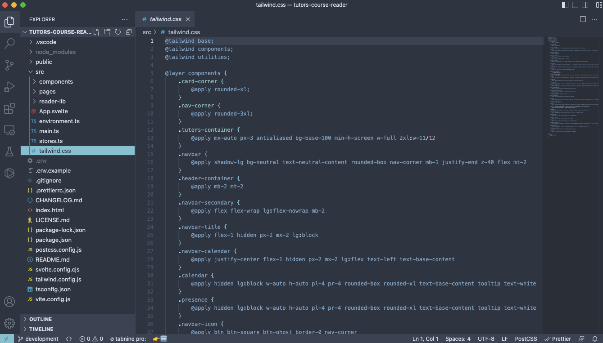
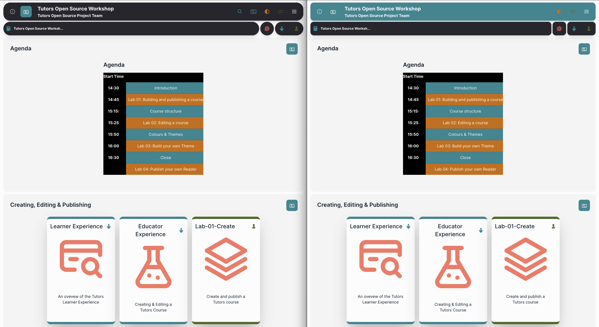

# Updating Components

Next let's have a look at the components and see what we can change around. 

Open up the src/tailwind.css file. Here we can see all the components which have been created for the Tutors Design System.

These components are created by applying Tailwind utility classes. You can find out more about utility first classes at the tailwind documentation [here](https://tailwindcss.com/docs/utility-first).

Let's try making a few small changes that gives big results to give you an idea how powerful these are.

Update the `.nav-corner` class and change `rounded-3xl` to `rounded-xl`, then update the `.navbar` class and change `bg-neutral` to `bg-primary`.

Take a look at the difference this makes from updating 2 small values!

Play around with these values and see what you can do with them. How about trying to change the cards to be more rounded and have a dark background?