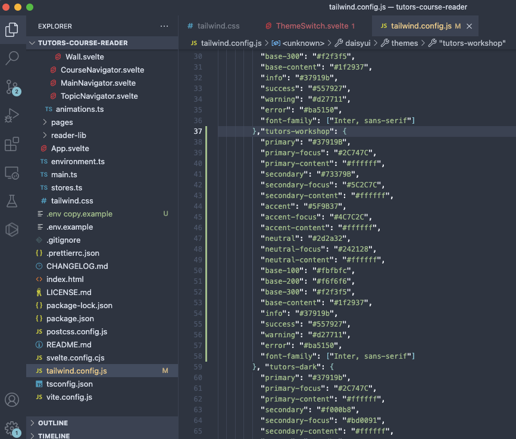
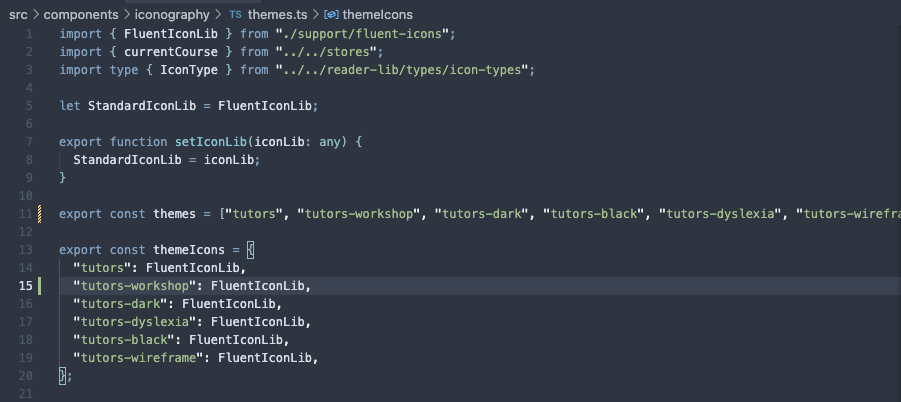
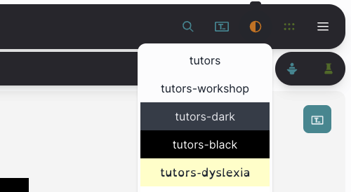
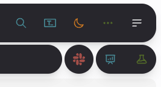

# Creating a new theme

Let's have a go at creating our own theme and add it to the theme menu on our local instance.

First up, let's add the theme to our `tailwind.config.js` file. Head to the file and add a theme underneath the `tutors` theme by copying this theme's data and giving it a new name - in this example calling it `tutors-workshop`.

We're going to want to add the theme to the themes menu in the navbar so we can see our theme updating as we change it! Head to the `src/components/iconography/themes.ts` file. This is where the themes are declared.

In the `themes` array, add your theme name (in this example, `tutors-workshop`). Also in the `themeIcons` object, copy the same syntax as the rest of the values and add your theme. This sets the default icon library being used.

The new theme should now be added to the menu in our locally running instance.

Select this theme and we can start updating the values of the theme in `tailwind.config.js` to what we want!

Bonus:

Let's import the hero-icons library and update our theme to use it! This is a hidden icon library in the reader so we may aswell make use of it!

At the top of the `src/components/iconography/themes.ts` file import the library by adding the line `import { HeroIconLib } from "./support/hero-icons"`.

Then in the `themeIcons` object update your theme's icon library from `FluentIconLib` to `HeroIconLib`.

Select your theme, refresh your browser and the icon set will update to Hero Icons!

